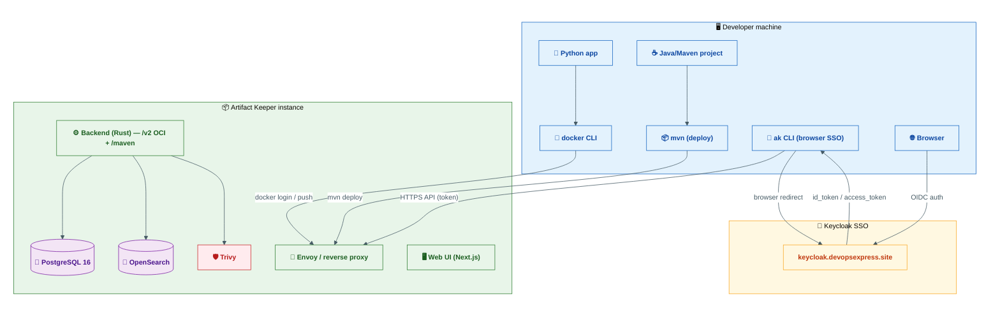

<p align="center">
  
</p>

<h1 align="center">Artifact Keeper Demo</h1>
<h3 align="center">Docker &amp; Maven push scenarios driven by the <code>ak</code> CLI</h3>

<p align="center">
  
  
  
  
  
  
</p>

A self-contained, step-by-step demo of pushing artifacts to a private
[**Artifact Keeper**](https://artifactkeeper.com/) registry — the open-source
Artifactory alternative — using the official **`ak` CLI**.

> [!NOTE]
> **Registry used by this demo:** `https://artifact-keeper.devopsexpress.site`
> — a self-hosted Artifact Keeper instance secured with **Keycloak** SSO.

---

## Table of contents

- [What you will do](#what-you-will-do)
- [Architecture](#architecture)
- [Repository layout](#repository-layout)
- [Quick start](#quick-start)
- [Documentation](#documentation)
- [Why Artifact Keeper?](#why-artifact-keeper)
- [License](#license)

---

## What you will do

| # | Scenario | What happens | Output |
|---|----------|--------------|--------|
| 1 | [Docker image](docs/05-scenario-docker.md) | Build a tiny Python HTTP service (`greet-service`), then **push the image** to the private registry | `artifact-keeper.devopsexpress.site/docker-local/greet-service:1.0.0` |
| 2 | [Maven artifact](docs/06-scenario-maven.md) | Build a tiny Java library (`hello-lib`) with Maven, then **deploy the artifact** to the private registry | `com.example:hello-lib:1.0.0` in `maven-local` |

Everything is driven from the command line with the **`ak` CLI** —
installing it, connecting to the registry, creating repositories, pushing
artifacts, and verifying the results.

## Architecture



> 🟦 **Blue** = client tooling · 🟧 **Orange** = identity & SSO · 🟩 **Green** = registry core · 🟪 **Purple** = storage & search · 🟥 **Red** = security

## Repository layout

```
artifactory-keeper-demo/
├── README.md                     # you are here
├── docs/                         # step-by-step documentation (start with 00)
│   ├── 00-overview.md            # what & why
│   ├── 01-prerequisites.md       # Docker, Python, JDK + Maven (Arch/Ubuntu/macOS)
│   ├── 02-install-cli.md         # ak CLI: Arch, Ubuntu, macOS
│   ├── 03-connect-auth.md        # connect + authenticate (Keycloak SSO / tokens)
│   ├── 04-repositories.md        # create repositories with ak
│   ├── 05-scenario-docker.md     # Scenario 1: push a Docker image
│   ├── 06-scenario-maven.md      # Scenario 2: deploy a Maven artifact
│   └── 07-verify-troubleshoot.md # verification, scanning, TUI, FAQ
├── scenario-1-docker/            # greet-service (Python) + Dockerfile
├── scenario-2-maven/             # hello-lib (Java) + pom.xml + settings.xml
├── scripts/                      # runnable, ordered scripts (01 → 05)
└── assets/icons/                 # icons used in this documentation
```

## Quick start

```bash
# 1. Install the ak CLI (Arch / Ubuntu / macOS)
./scripts/01-install-cli.sh

# 2. Connect to the registry, log in (Keycloak SSO), create repositories
./scripts/02-bootstrap.sh

# 3. Scenario 1 — build + push the Docker image
./scripts/03-docker-push.sh

# 4. Scenario 2 — build + deploy the Maven artifact
./scripts/04-maven-deploy.sh

# 5. Verify everything landed in the registry
./scripts/05-verify.sh --pull
```

> [!TIP]
> **Headless / CI?** Export `AK_TOKEN=<api-token>` and `AK_NO_INPUT=1` —
> every script works without a browser. See
> [docs/03-connect-auth.md](docs/03-connect-auth.md).

## Documentation

The full walkthrough lives in [`docs/`](docs/00-overview.md) — every command
is copy-pasteable, with OS-specific instructions for **Arch Linux, Ubuntu,
and macOS**, diagrams, expected outputs, and troubleshooting.

| Doc | Topic |
|-----|-------|
| [00 — Overview](docs/00-overview.md) | What & why, architecture, glossary |
| [01 — Prerequisites](docs/01-prerequisites.md) | Docker, Python, JDK + Maven |
| [02 — Install the ak CLI](docs/02-install-cli.md) | Arch, Ubuntu, macOS |
| [03 — Connect & authenticate](docs/03-connect-auth.md) | Keycloak SSO + API tokens |
| [04 — Repositories](docs/04-repositories.md) | Create `docker-local` + `maven-local` |
| [05 — Scenario 1: Docker](docs/05-scenario-docker.md) | Build & push the image |
| [06 — Scenario 2: Maven](docs/06-scenario-maven.md) | Build & deploy the artifact |
| [07 — Verify & troubleshoot](docs/07-verify-troubleshoot.md) | Checks, scanning, FAQ |

## Why Artifact Keeper?

| | Artifact Keeper | Artifactory Pro |
|---|---|---|
| Package formats | 45+ (Docker/OCI, Maven, npm, PyPI, …) | ✓ |
| Vulnerability scanning | **Included** (Trivy + OpenSCAP + Dependency-Track) | paid add-on |
| License | **MIT — $0 forever** | ~$750/month |
| Self-hosted | ✓ | ✓ |

> Based on the official feature comparison at
> [artifactkeeper.com](https://artifactkeeper.com/).

## License

Demo material (examples, scripts, docs) — MIT. Artifact Keeper itself is
MIT-licensed. All product names and trademarks belong to their respective
owners.
