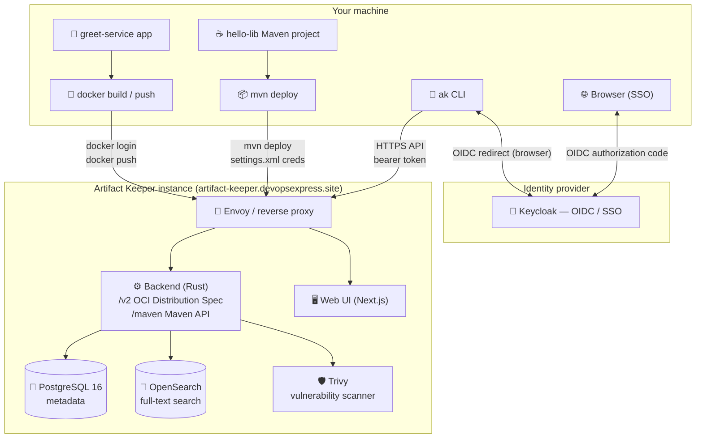

# 00 — Overview

  

**Artifact Keeper** is an open-source (MIT) alternative to JFrog Artifactory:
a self-hosted artifact
registry supporting **45+ package formats** (Docker/OCI, Maven, npm, PyPI,
NuGet, Helm, …) with **vulnerability scanning included** (Trivy, OpenSCAP,
Dependency-Track) and no feature gates or per-user fees.

This demo shows the two most common registry workflows, driven entirely
from the command line with the official **`ak` CLI**:

1. **Scenario 1 — Docker image push** (`docs/05-scenario-docker.md`)
   A tiny Python HTTP service is built into a container image and pushed
   to the private registry.

2. **Scenario 2 — Maven artifact deploy** (`docs/06-scenario-maven.md`)
   A tiny Java library is built with Maven and deployed to the private
   registry, ready to be consumed as a dependency by other projects.

## The registry used by this demo

| Property | Value |
|---|---|
| Web UI + API | `https://artifact-keeper.devopsexpress.site` |
| Docker/OCI endpoint | `https://artifact-keeper.devopsexpress.site/v2` |
| Maven endpoint | `https://artifact-keeper.devopsexpress.site/maven` |
| Authentication | **Keycloak SSO** (OIDC) at `keycloak.devopsexpress.site` |
| Repositories | `docker-local` (docker) · `maven-local` (maven) |

> [!NOTE]
> **HTTPS, no port.** The official Artifact Keeper docs use
> `http://localhost:8080` for local deployments. This demo targets a
> remote managed instance, so all endpoints use the HTTPS host above.

## Architecture

**Flow in plain English**

1. Your machine holds the two demo projects and the `ak` CLI.
2. `docker` and `mvn` talk directly to the registry over HTTPS; the `ak`
   CLI manages repositories and artifacts via the registry API.
3. Every request is authenticated: the `ak` CLI uses **Keycloak SSO**
   (browser login) or an **API token**; `docker login` and Maven use
   username/password or token credentials.
4. Behind the reverse proxy, the Rust backend stores metadata in
   **PostgreSQL**, indexes it in **OpenSearch**, and hands images to
   **Trivy** for vulnerability scanning — automatically, with no extra
   configuration.

## Key concepts (glossary)

| Term | Meaning |
|---|---|
| **Registry** | The server that stores and serves artifacts (this demo: the Artifact Keeper instance). |
| **Repository** | A named container for artifacts of one format: `docker-local`, `maven-local`. |
| **Artifact** | A file (or set of files) stored in a repository — a container image, a `.jar`, a `.tar.gz`, … |
| **Instance (ak)** | A named, saved reference to a registry server (`ak instance add demo <url>`). |
| **API token** | A long-lived credential for headless/CI use, created after SSO login. |
| **OCI** | Open Container Initiative — the standard protocol Docker uses to push/pull. |
| **GAV** | Maven coordinates: **G**roupId **:** **A**rtifactId **:** **V**ersion. |
| **distributionManagement** | The `pom.xml` section that tells Maven where to deploy. |

## What you need

| Tool | Purpose | Minimum |
|---|---|---|
| Docker | Build + push the image (Scenario 1) | 20.10+ |
| Python 3 | Build context for the demo app | 3.10+ (only needed to run the app locally) |
| JDK + Maven | Build + deploy the jar (Scenario 2) | JDK 21, Maven 3.9+ |
| `ak` CLI | Manage the registry from the terminal | 1.0+ |

**Next:** [01 — Prerequisites](01-prerequisites.md)
