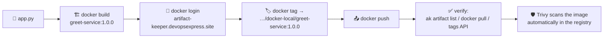

# 05 — Scenario 1: Push a Docker Image

<p align="center">
  
  
</p>

Build a tiny Python HTTP service, tag it for the private registry, and
**push it with the Docker CLI** to the `docker-local` repository of your
Artifact Keeper instance.

**Artifact produced:** `artifact-keeper.devopsexpress.site/docker-local/greet-service:1.0.0`

**Official docs:** <https://artifactkeeper.com/docs/guides/docker/>

---

## Flow



## Step 1 — Look at the demo app

```bash
cd scenario-1-docker
cat app.py
```

A zero-dependency Python HTTP server (stdlib only):

- `GET /` → `{"message": "Hello from greet-service!", ...}`
- `GET /healthz` → `{"status": "ok"}`

Optional — run it locally first:

```bash
python3 app.py
curl http://localhost:8080/
```

## Step 2 — Build the image

```bash
docker build -t greet-service:1.0.0 .
```

The `Dockerfile`:

- Base: `python:3.13-alpine`
- Runs as **non-root user** (`appuser`) — good hygiene that registry
  security scanners look for
- Declares `LABEL` metadata (title, version, license, source)
- Adds a `HEALTHCHECK` hitting `/healthz`

Verify the image exists:

```bash
docker images greet-service
```

## Step 3 — Authenticate to the registry

```bash
docker login artifact-keeper.devopsexpress.site
```

Enter your **Keycloak username** and **password** (or an API token) when
prompted.

> [!TIP]
> **Headless**: `echo "$TOKEN" | docker login artifact-keeper.devopsexpress.site -u <user> --password-stdin`

This performs the OCI bearer-token dance against the registry's token
endpoint (`/v2/token`) and stores credentials in `~/.docker/config.json`.

## Step 4 — Tag the image for the registry

```bash
docker tag greet-service:1.0.0 \
  artifact-keeper.devopsexpress.site/docker-local/greet-service:1.0.0
```

The path is `**<registry-host>**/**<repo-key>**/**<image-name>**:**<tag>**`.

Also tag `latest` if you like (immutable version tags are best practice):

```bash
docker tag greet-service:1.0.0 \
  artifact-keeper.devopsexpress.site/docker-local/greet-service:latest
```

## Step 5 — Push

```bash
docker push artifact-keeper.devopsexpress.site/docker-local/greet-service:1.0.0
```

Expected output:

```
The push refers to repository [artifact-keeper.devopsexpress.site/docker-local/greet-service]
...
1.0.0: digest: sha256:7f5a... size: 1123
```

> [!NOTE]
> Artifact Keeper **deduplicates image layers** across repositories, and
> **Trivy scans the image automatically** (check the Web UI for the scan
> report).

## Step 6 — Verify

### a) List artifacts with the `ak` CLI

```bash
ak artifact list docker-local
```

### b) Query the OCI tags API

```bash
# The tags endpoint requires authentication. Use your Keycloak username
# + password (or API token) — the same credentials as `docker login`:
curl -s -u "$DOCKER_USERNAME:$DOCKER_PASSWORD" \
  https://artifact-keeper.devopsexpress.site/v2/docker-local/greet-service/tags/list | jq
```

Expected response:

```json
{
  "name": "docker-local/greet-service",
  "tags": ["1.0.0"]
}
```

> [!TIP]
> No credentials handy? The Web UI lists tags under the artifact page, or
> run `scripts/05-verify.sh`, which handles authentication for you.

### c) Pull it back (round-trip proof)

```bash
docker pull artifact-keeper.devopsexpress.site/docker-local/greet-service:1.0.0
docker run --rm -p 8080:8080 \
  artifact-keeper.devopsexpress.site/docker-local/greet-service:1.0.0
curl http://localhost:8080/
```

### d) Inspect the manifest

```bash
docker manifest inspect artifact-keeper.devopsexpress.site/docker-local/greet-service:1.0.0
```

---

## One-shot script

```bash
./scripts/03-docker-push.sh                 # uses defaults
./scripts/03-docker-push.sh 1.1.0           # other version
DOCKER_PASSWORD=<token> ./scripts/03-docker-push.sh   # headless
```

---

## Troubleshooting

| Problem | Fix |
|---|---|
| `docker login` fails with 401 | Wrong username/password. Use your **Keycloak** credentials or a valid API token. |
| `push` → `unauthorized: authentication required` | You are not logged in (`docker login`) or your token lacks `deploy` permission on `docker-local`. |
| `push` → `404 repository not found` | Repository `docker-local` does not exist — create it (`ak repo create docker-local --pkg-format docker --repo-type local`). |
| TLS errors | The instance uses a valid certificate; if you see TLS errors your local CA store is out of date (`sudo update-ca-certificates` on Ubuntu, `pacman -S ca-certificates` on Arch). |
| `denied: exceeded rate limit` | Registry rate limiting — retry after a moment or authenticate first. |

---

✅ Image pushed.

**Prev:** [04 — Repositories](04-repositories.md) · **Next:** [06 — Scenario 2: Maven](06-scenario-maven.md)
