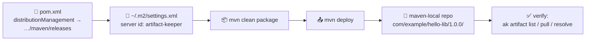

# 06 — Scenario 2: Deploy a Maven Artifact

<p align="center">
  
  
</p>

Build a tiny Java library with **Maven** and **deploy it** to the
`maven-local` repository of your Artifact Keeper instance, so other
projects can consume it as a dependency.

**Artifact produced:** `com.example:hello-lib:1.0.0` (jar + pom + checksums)

**Official docs:** [Artifact Keeper — Maven guide](https://artifactkeeper.com/docs/guides/maven/)

---

## Flow



## Step 1 — Look at the project

```bash
cd scenario-2-maven
tree
```

```
├── pom.xml                          # build + distributionManagement
├── settings.xml.example             # template for ~/.m2/settings.xml
└── src/main/java/com/example/
    └── HelloLib.java                # tiny utility class
```

The coordinates (GAV):

```xml
<groupId>com.example</groupId>
<artifactId>hello-lib</artifactId>
<version>1.0.0</version>
```

## Step 2 — Configure credentials (settings.xml)

Maven looks up credentials in `~/.m2/settings.xml` under a `<server>` whose
`<id>` **matches** the `<distributionManagement>` `<id>` in `pom.xml`
(`artifact-keeper`).

Copy the template and fill in your Keycloak username + password **or an
API token** (preferred):

```bash
mkdir -p ~/.m2
cp settings.xml.example ~/.m2/settings.xml
$EDITOR ~/.m2/settings.xml
```

```xml
<servers>
  <server>
    <id>artifact-keeper</id>
    <username>YOUR_USERNAME</username>
    <password>YOUR_PASSWORD_OR_API_TOKEN</password>
  </server>
</servers>
```

> [!TIP]
> **Automatic alternative** — the `ak` CLI writes this file for you:
>
> ```bash
> ak setup maven --repo maven-local
> ```
>
> (`ak setup` auto-detects your toolchains: `ak setup auto`)

## Step 3 — Check distributionManagement in pom.xml

```xml
<distributionManagement>
  <repository>
    <id>artifact-keeper</id>
    <name>Artifact Keeper Releases</name>
    <url>https://artifact-keeper.devopsexpress.site/maven/releases</url>
  </repository>
  <snapshotRepository>
    <id>artifact-keeper</id>
    <name>Artifact Keeper Snapshots</name>
    <url>https://artifact-keeper.devopsexpress.site/maven/snapshots</url>
  </snapshotRepository>
</distributionManagement>
```

- **Release versions** (`1.0.0`) go to `/maven/releases`
- **Snapshot versions** (`1.0.0-SNAPSHOT`) go to `/maven/snapshots`

> [!NOTE]
> The registry's Caddy/reverse-proxy routes `/maven/*` to the backend,
> which stores artifacts under the `maven-local` repository.

## Step 4 — Build

```bash
mvn clean package
```

This compiles `HelloLib.java` and produces:

```
target/hello-lib-1.0.0.jar
```

## Step 5 — Deploy

```bash
mvn deploy
```

Expected output (abbreviated):

```
[INFO] Uploading to artifact-keeper: https://artifact-keeper.devopsexpress.site/maven/releases/com/example/hello-lib/1.0.0/hello-lib-1.0.0.jar
[INFO] Uploaded to artifact-keeper: ... hello-lib-1.0.0.jar (2.5 kB at 12 kB/s)
[INFO] Uploaded to artifact-keeper: ... hello-lib-1.0.0.pom
[INFO] Uploaded to artifact-keeper: ... hello-lib-1.0.0.jar.sha1 ...
[INFO] BUILD SUCCESS
```

Maven uploads the **jar**, the **pom**, and **checksums** — everything a
consumer needs.

## Step 6 — Verify

### a) With the `ak` CLI

```bash
ak artifact list maven-local
ak artifact search hello-lib --pkg-format maven
```

### b) Inspect metadata

```bash
ak artifact info maven-local com/example/hello-lib/1.0.0/hello-lib-1.0.0.jar
```

### c) Download the jar back

```bash
ak artifact pull maven-local com/example/hello-lib/1.0.0/hello-lib-1.0.0.jar -o /tmp/hello-lib.jar
unzip -l /tmp/hello-lib.jar   # shows HelloLib.class
```

### d) Consume it as a dependency (round-trip proof)

Create a scratch project (or any existing one) and add:

```xml
<dependency>
  <groupId>com.example</groupId>
  <artifactId>hello-lib</artifactId>
  <version>1.0.0</version>
</dependency>
```

Maven resolves it from the registry if you use it as a repository:

```xml
<repositories>
  <repository>
    <id>artifact-keeper</id>
    <url>https://artifact-keeper.devopsexpress.site/maven</url>
    <releases><enabled>true</enabled></releases>
    <snapshots><enabled>true</enabled></snapshots>
  </repository>
</repositories>
```

(or configure it as a **mirror** in settings.xml to proxy Maven Central
through your registry).

---

## One-shot script

```bash
./scripts/04-maven-deploy.sh                                # interactive (uses ~/.m2/settings.xml)
AK_MAVEN_USERNAME=alice AK_MAVEN_PASSWORD=<token> \
  ./scripts/04-maven-deploy.sh                              # headless
```

---

## Snapshot vs Release

| Version | Deploy URL | Behaviour |
|---|---|---|
| `1.0.0` | `/maven/releases` | Immutable; refuses re-deploy of same version (unless policy allows) |
| `1.0.1-SNAPSHOT` | `/maven/snapshots` | Overwritable; `mvn deploy` each build |
| `1.1.0-SNAPSHOT` | `/maven/snapshots` | Timestamped + `maven-metadata.xml` for resolution |

---

## Troubleshooting

| Problem | Fix |
|---|---|
| `[ERROR] Failed to deploy artifacts: Could not transfer ... 401` | Credentials missing/wrong in `~/.m2/settings.xml`; verify the `<id>` matches `artifact-keeper`. |
| `Could not transfer ... 404` | Repository `maven-local` missing or the path layout changed; create the repo and re-deploy. |
| `Access denied to: maven-local` | Your token/user lacks `deploy` permission on the repository. |
| `Cannot access ... in offline mode` | You ran with `-o` (offline); remove it. |
| Snapshot not updating | Snapshots are cached locally; force with `mvn -U` (or check snapshot update policy). |

---

✅ Artifact deployed.

**Prev:** [05 — Scenario 1: Docker](05-scenario-docker.md) · **Next:** [07 — Verify & troubleshoot](07-verify-troubleshoot.md)
